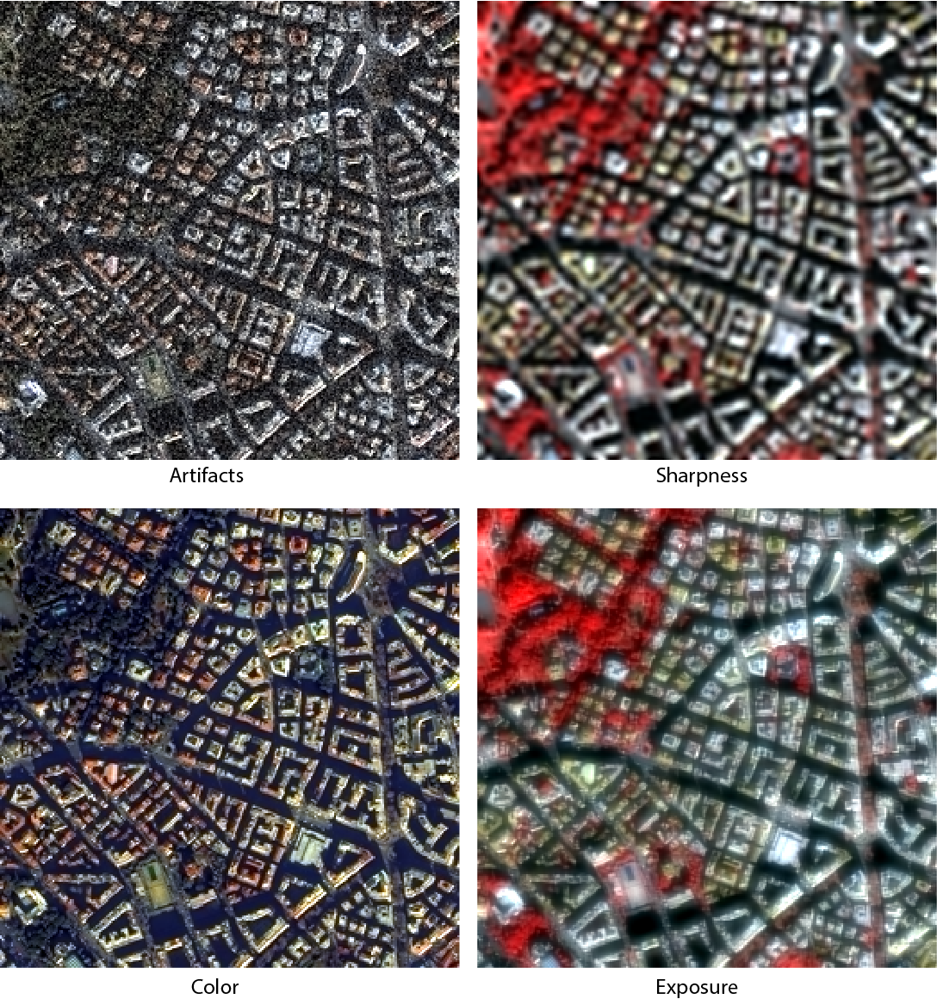

# Pansharpening Image Quality Analizer

This repository contains all the details and results of the subjective study of pan-sharpened images developed at Pontificia Universidad Javeriana Cali, Colombia and some proposed IQA for these images.

## Evaluation dataset

The dataset is composed of 440 images, where half are images in true color and the other half images in pseudocolor. True color images are composed of the red (R), green (G) and blue (B) bands, that constitute the visible spectrum. The pseudocolor images are composed of near infrared (NIR), R, G bands, according to [1].    

From these images, ten are pristine multi-spectral images, ten are interpolated multi-spectral images [2],  and 420 are fused images using six different fusion techniques, three of them belong to the multi-resolution (MR) category and three of them are based om principal component substitution (PC). Two distortions (blur and additive white gaussian noise (awgn)) are applied to five different scenes of the pristine Roma image from Digital Globe [3] with three intensity levels. In  total, there are:

* Five Scenes.
* Two color planes.
* Six fusion techniques.
* Two distortions that are only applied to the panchromatic image.
* Three distortion levels.

## Image Codification
 
Each image in the dataset has a tagged name that specifies the applied process. The image tag have the following order representation:

The first part of the tag indicates whether the representation of the image is true color (TC) or pseudocolor (PC), As shown below.

 

The second part is a scene tag, as shown below.

 

The third part is a fusion technique tag. The following table shows the acronyms of the fusion techniques.

| Acronym    | Fusion Technique                                                                                   |
|:-----------|:---------------------------------------------------------------------------------------------------|
| REF        | Not fused MS image                                                                                 |
| EXP        | MS image interpolation, using polinomial kernel with 23 coefficients [2]                           |
| BDSD       | Band-Dependent Spatial-Detail with local parameter estimator [4]                                   |
| PCA        | Principal Component Analysis [5]                                                                   |
| IHS        | Fast Intensity-Hue-Saturation (GIHS) image fusion [6]                                              |
| MTF-GLP-CBD| Generalized Laplacian Pyramid [2] with MTF-matched filter [7] and multiplicative injection mode [8]|
| ATWT-M2    | A Trous Wavelet Transform with Mode 2 [9]                                                          |
| HPF        | High-Pass Filtering with 5x5 box filter for 1:4 fusion [5]                                         |

The fourth part is a distortion tag. The following table shows the acronyms of the distortions.

| Acronym| Distortion                   |
|:-------|:-----------------------------|
| UD     | Undistorted                  |
| Blr    | Blur                         |
| AWGN   | Additive White Gaussian Noise|

The final part is a intensity level for distorted images as shown in the following table.

| Level   | Blur(σ) | AWGN(σ) |
|:--------|:--------|:--------|
| 1       | 3       | 0.05    |
| 2       | 5       | 0.10    |
| 3       | 7       | 0.15    |

The following images show an true color image of Coliseum scene fused by BDSD with local parameter estimator, distorted with diferent impairments and distortion levels.

 

For example if an image have the following tag: PC_Coliseum_MTF-GLP-CBD_AWGN_Level-2. This refers to a pseudocolor image of Coliseum scene fused by generalized laplacian pyramid with MTF-matched filter and multiplicative injection mode, distorted with additive white gausion noise using σ = 0.10.

## Study Procedure

Before beginning the study, the subjects will be explained the different types of distortion present in the images as following: 

* Artifacts: Noise and blockiness distortions not part of the video content.
* Color: Videos with incorrect or insufficient color repre-sentation.
* Sharpness: General unsharpness, i.e., lack of detail,texture, or sharpness. This distortion differs from out-of-focus distortion in that with sharpness distortion, objects are in focus but do not appear ‘crisp’ or detailed.
* Exposure: Over/under-exposure, making it difficult to seeparts or the entirety of the scene.

Following images shows the diferent distortion types.

At the start of the first session, the subjects are vision examined using Snellen and Ishara tests. If someone doesn’t do well on the vision test, we still want them in our study [9]. Test images will be displayed to acquaint the participants with the images and the interface. A total of four images with different color representation and distortions will be presented to the subjects in the test procedure. These images are not related to the images of the study to avoid biasing the participants.

The session routines are developed in Matlab and the PsychToolbox [11]. The procedure follows the recommendations mentioned in [12], where the subjects indicated the quality of the video on a continuous scale between [0, 100], in which each original image is included in the experiment but not identified as such. The test will be performed with a HP S1933 monitor (18.5")  and a Intel HD 4000 graphic card to observe the images, and the screen resolution set to 1366 x 768 @ 60 Hz, at a viewing distance that will be between 45cm and 55cm. The stimulus images will be displayed at their native resolution to prevent distortions due to scaling operations. Areas outside the images are set to black. 

The study will take place during three sessions of 25 minutes each with 40 voluntaries. In each session, 147 images will be evaluated  for a total of 440 images. The sequence will start displaying a single stimulus image for 7 seconds as depicted in the following image.

Then a subject will rate the image using a continuous sliding quality bar with labels "Bad", "Poor", "Fair", "Good", or "Excellent", as shown below. 

Finally, the subject selects the most relevant distortion doing a keyboard selection.

In addition, we will calibrate and measure the display using an Spyder5 PRO calibrator [13], and develop the study in a low-light room according to the display calibrator specifications.

## Collected Data

The information collected is accommodated in a .mat file for each subject where a 240x9 cell is located. The columns of the cell have the following order: 

1. Image tag. 
2. Score. 
3. The most relevant distortion type. 
4. Spend time to qualify the image. 
5. Does the subject use some method of vision correction? 
6. Subject Ishihara tested result. 
7. Subject Snellen tested result. 
8. Screen Gamma. 
9. Screen White Point.   

## References
1. Alparone, Luciano, et al. "Comparison of pansharpening algorithms: Outcome of the 2006 GRS-S data-fusion contest." IEEE Transactions on Geoscience and Remote Sensing 45.10 (2007): 3012-3021.
2. Aiazzi, Bruno, et al. "Context-driven fusion of high spatial and spectral resolution images based on oversampled multiresolution analysis." IEEE Transactions on geoscience and remote sensing 40.10 (2002): 2300-2312.
3. Digital Globe https://www.digitalglobe.com/.
4. Garzelli, Andrea, Filippo Nencini, and Luca Capobianco. "Optimal MMSE pan sharpening of very high resolution multispectral images." IEEE Transactions on Geoscience and Remote Sensing 46.1 (2008): 228-236.
5. Chavez, Pats, Stuart C. Sides, and Jeffrey A. Anderson. "Comparison of three different methods to merge multiresolution and multispectral data- Landsat TM and SPOT panchromatic." Photogrammetric Engineering and remote sensing 57.3 (1991): 295-303.
6. Tu, Te-Ming, et al. "A new look at IHS-like image fusion methods." Information fusion 2.3 (2001): 177-186.
7. Aiazzi, B., et al. "MTF-tailored multiscale fusion of high-resolution MS and Pan imagery." Photogrammetric Engineering & Remote Sensing 72.5 (2006): 591-596.
8. Aiazzi, B., et al. "An MTF-based spectral distortion minimizing model for pan-sharpening of very high resolution multispectral images of urban areas." Remote Sensing and Data Fusion over Urban Areas, 2003. 2nd GRSS/ISPRS Joint Workshop on. IEEE, 2003.
9. Ranchin, Thierry, and Lucien Wald. "Fusion of high spatial and spectral resolution images: the ARSIS concept and its implementation." Photogrammetric Engineering and Remote Sensing 66.1 (2000): 49-61.
10. Moorthy, Anush Krishna, et al. "Video quality assessment on mobile devices: Subjective, behavioral and objective studies." IEEE Journal of Selected Topics in Signal Processing 6.6 (2012): 652-671.
11. Brainard, David H., and Spatial Vision. "The psychophysics toolbox." Spatial vision 10 (1997): 433-436.
12. Seshadrinathan, Kalpana, et al. "Study of subjective and objective quality assessment of video." IEEE transactions on image processing 19.6 (2010): 1427-1441..
13. Spyder5 PRO Datacolor http://www.datacolor.com/photography-design/product-overview/spyder5-family/#spyder5pro.

